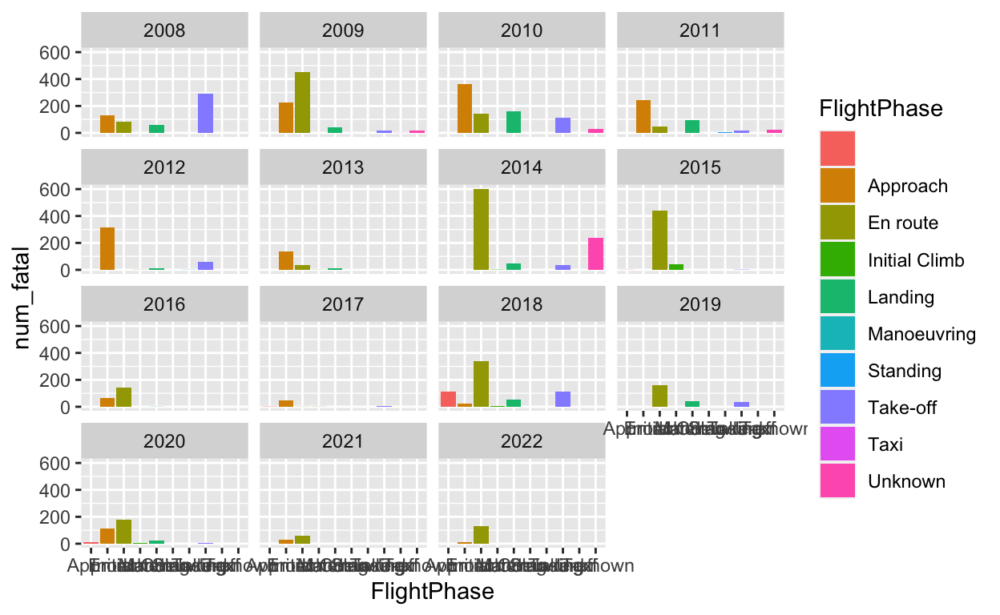
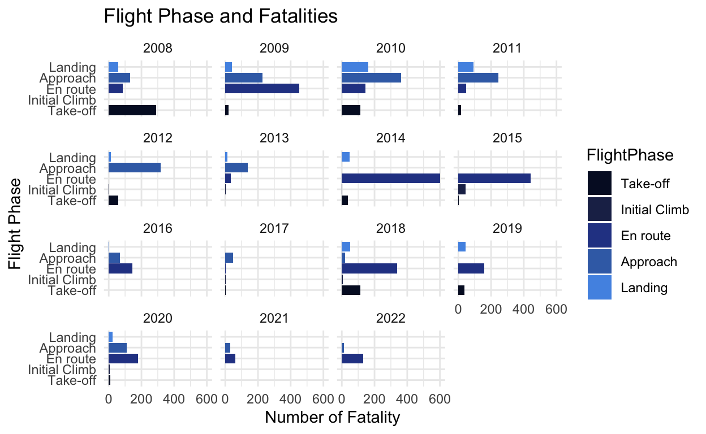

```{r setup, include=FALSE}
knitr::opts_chunk$set(echo = FALSE)
```

```{r eval = T, echo = F}
library(tidyverse)
library(ggthemes)
library(plotly)

df<-read.csv("data/ICAO_accidents.csv") 

#Country abbreviation to country full name
world <- read.csv("data/world.csv") %>% 
    rename(StateOfOccurrence = Abbreviation)

df <- left_join(df, world)
com <- filter(df, df$ScheduledCommercial == "True") %>% select(Year, Country, Model, Fatalities, Over2250, Over5700, InjuryLevel, Risk, FlightPhase, EngineType)


```

```{r eval = T, echo = F}
FP <- com %>% group_by(Year, FlightPhase, na.rm = T) %>% summarize(num_fatal = sum(Fatalities, na.rm = T))

FP <- FP %>% filter(FlightPhase != "" & FlightPhase != "Unknown" & FlightPhase != "Taxi" & FlightPhase != "Standing" & FlightPhase != "Manoeuvring")
```

**Old Version**

<p align="center">
  
</p>

<p align="center">
  
</p>

```{r eval = T, echo = F}
level_order <- c("Take-off", "Initial Climb", "En route", "Approach", "Landing" )

FP$FlightPhase <- factor(FP$FlightPhase, level = level_order)

plot <- ggplot(FP, aes(x = Year, y = num_fatal)) +  
  geom_col(aes (fill = num_fatal)) + 
  facet_wrap(~FlightPhase) + 
  labs(title = "When the flight risk happen the most? Why you need to put on seat bell during flight?",
    subtitle = "Trend in fatalities across years in each Risk Phase", 
       y = "Number of Fatality", 
       x = "Year") +
  scale_fill_gradient(low = "#ADD8E6", high = "#000080")+
  labs(fill = "Fatalities")+
  theme_minimal()
  
```

**Final Version**

```{r , layout="l-page", eval = T, echo = F}
plot
```

<p align="center">
  
</p>

This plot represents the number of fatalities (from 2008 - 2022) each year from across different flight phase (i.e., from Approach to Landing). The x axis represents the year from 2008 to 2022, and the y axis represents the number of fatal number. The group of flight phase are represented on the facet. From this plot, we can easily distinguish that in 2014, flights cause more fatal number during the flight. The flight phase causes the most fatal is En-Route. That is why we need to keep our sit bell on during the flight.

This plot is intended for a general audience. See the plots on the below for different iterations of this visualization.


